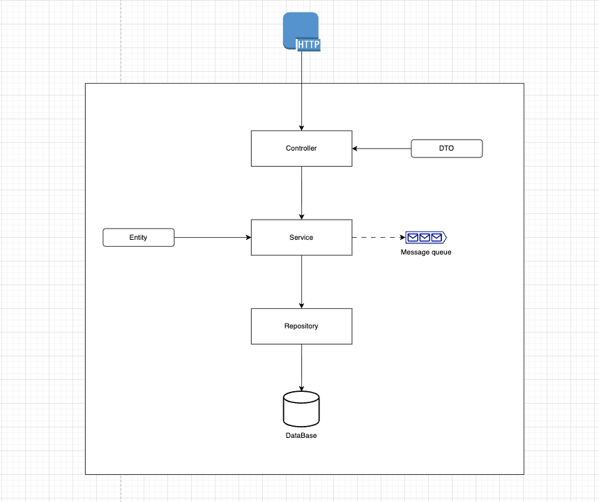

# MCC Customer Service

Microservicio responsable de la gestión de clientes dentro del proyecto **microservices-bank**. Permite operaciones básicas sobre clientes como creación, consulta, actualización y eliminación.

## Estructura principal

- `controller` – Exposición de endpoints REST.
- `dto` – Objetos de transferencia de datos.
- `entity` – Modelos de base de datos.
- `repository` – Interfaces para acceso a datos.
- `service` – Lógica de negocio.
- `util` – Clases auxiliares para mapeos y operaciones CRUD genéricas.

