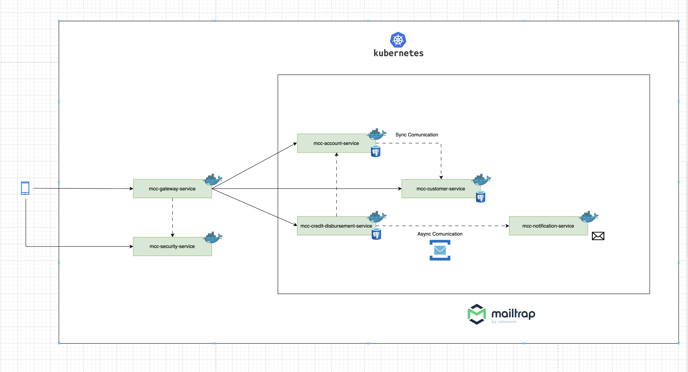

# Microservices Bank

Sistema de microservicios para una aplicación bancaria desarrollado en **Java con Spring Boot**, como parte de un curso de **arquitectura de microservicios**.  
El proyecto simula una plataforma bancaria donde diferentes dominios del negocio están separados en servicios independientes.

## Arquitectura

La aplicación sigue una arquitectura basada en microservicios donde cada servicio es responsable de una parte específica del dominio.  
Todas las solicitudes externas pasan primero por el **API Gateway**, que actúa como punto de entrada al sistema.

Los servicios se comunican entre sí y se ejecutan de forma independiente utilizando **contenedores Docker**.

### Diagrama de arquitectura



## Microservicios

El proyecto está compuesto por los siguientes servicios:

- **mcc-gateway-service**  
  API Gateway. Gestiona el enrutamiento de las solicitudes hacia los microservicios correspondientes.

- **mcc-account-service**  
  Responsable de la gestión de **cuentas bancarias**.

- **mcc-customer-service**  
  Gestiona la información de los **clientes**.

- **mcc-credit-disbursement-service**  
  Maneja la lógica relacionada con **desembolsos de crédito**.

- **mcc-notification-service**  
  Encargado del envío de **notificaciones** a los usuarios.

## Tecnologías utilizadas

- Java  
- Spring Boot  
- Maven  
- Docker  
- Docker Compose  

## Requisitos

Antes de ejecutar el proyecto necesitas tener instalado:

- **Java**
- **Docker**
- **Docker Compose**

## Instalación y ejecución

Para levantar todos los servicios localmente:

```bash
docker-compose up
```

Este comando construirá las imágenes necesarias y ejecutará todos los microservicios definidos en el archivo docker-compose.yml.

